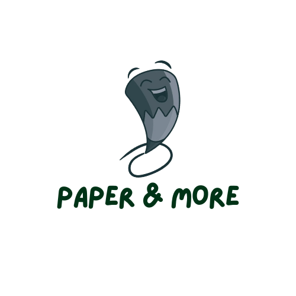
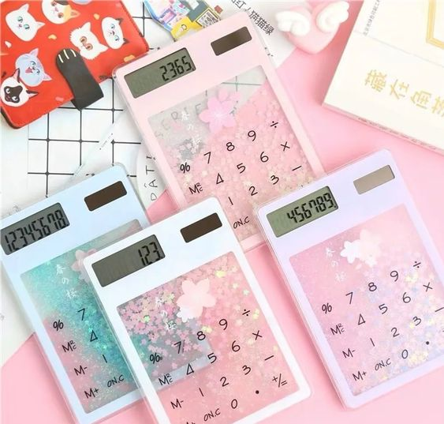
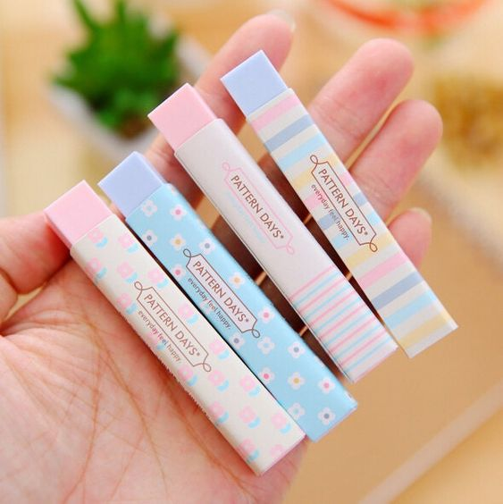
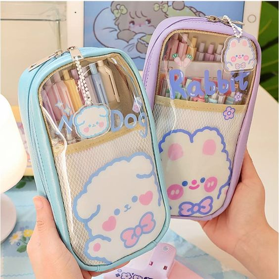
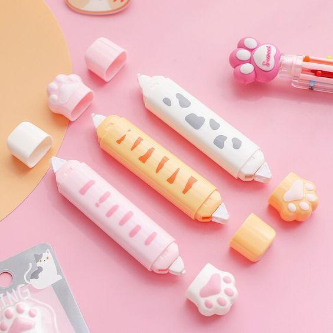
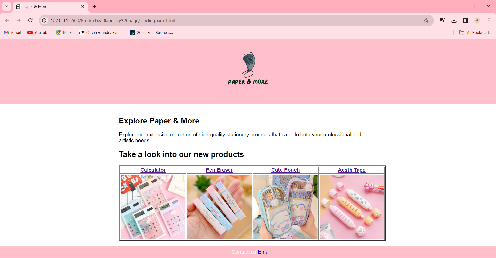

# BasicLandingPage - TechnoHacks

## Aim
    To create a basic landing page for a company or product that includes a header, footer, and some basic information.

## Program
    In landingpage.html
```
<html>
    <head>
    <link rel="icon" href="date.png">
    <title>Paper & More</title>
    <link rel="stylesheet" type="text/css" href="style.css">
    </head>
    <body>
        <header>
            
        </header>

    <div class="head">
        <h2> Explore Paper & More</h2>
        <p>Explore our extensive collection of high-quality stationery products that cater to both your professional and artistic needs.</p>
    <h2>Take a look into our new products</h2>
        <table rowspan="4" colspan="4" border="3">
            <tr>
                <th><a href="https://www.google.com/search?q=calculator&sca_esv=580414175&rlz=1C1CHBF_enIN1022IN1022&tbm=shop&sxsrf=AM9HkKk3eHnKgCCZ5YjvrxE5362t78GuBg:1699439038317&source=lnms&sa=X&ved=2ahUKEwiRo8jhl7SCAxVBavUHHaY8B5QQ_AUoAXoECAEQAw&biw=1536&bih=707&dpr=1.25">Calculator</a></th>
                <th><a href="https://www.google.com/search?q=eraser&sa=X&sca_esv=580414175&rlz=1C1CHBF_enIN1022IN1022&biw=1536&bih=707&tbm=shop&sxsrf=AM9HkKlIwyb7lEEP5Wg3e82wXi-f7m6bNw%3A1699439070806&ei=3mFLZee2MMDR1e8PlpidqAU&ved=0ahUKEwjnnYfxl7SCAxXAaPUHHRZMB1UQ4dUDCAg&uact=5&oq=eraser&gs_lp=Egtwcm9kdWN0cy1jYyIGZXJhc2VyMgUQABiABDIFEAAYgAQyBRAAGIAEMgUQABiABDIFEAAYgAQyBRAAGIAEMgUQABiABDIFEAAYgAQyBRAAGIAEMgUQABiABEivFlB6WOIUcAF4AJABA5gB-gGgAZ8OqgEGMy4xMC4xuAEDyAEA-AEBqAIBwgIEECMYJ8ICBxAAGIoFGEPCAgcQIxjqAhgniAYB&sclient=products-cc">Pen Eraser</a></th>
                <th><a href="https://www.google.com/search?q=pouch&sa=X&sca_esv=580414175&rlz=1C1CHBF_enIN1022IN1022&biw=1536&bih=707&tbm=shop&sxsrf=AM9HkKnxsnzLGF2WVz2m8chuKSblgXGrGQ%3A1699439143115&ei=J2JLZbajBoyK-Qa-uJXIDA&ved=0ahUKEwj20sSTmLSCAxUMRd4KHT5cBckQ4dUDCAg&uact=5&oq=pouch&gs_lp=Egtwcm9kdWN0cy1jYyIFcG91Y2gyBxAAGIoFGEMyBRAAGIAEMgUQABiABDIFEAAYgAQyBRAAGIAEMgUQABiABDIFEAAYgAQyBRAAGIAEMgUQABiABDIFEAAYgARIsxRQtQVYyxFwAngAkAEAmAGsAaABpAaqAQMwLja4AQPIAQD4AQGoAgLCAgcQIxjqAhgnwgIHEAAYgAQYCogGAQ&sclient=products-cc">Cute Pouch</a></th>
                <th><a href="https://www.google.com/search?q=tape&sa=X&sca_esv=580414175&rlz=1C1CHBF_enIN1022IN1022&biw=1536&bih=707&tbm=shop&sxsrf=AM9HkKmX3Zmk75vvFlHfID6FDSCPqsIgdg%3A1699439268476&ei=pGJLZcOfHNvS1e8P8o-x2Ag&ved=0ahUKEwjDgajPmLSCAxVbafUHHfJHDIsQ4dUDCAg&uact=5&oq=tape&gs_lp=Egtwcm9kdWN0cy1jYyIEdGFwZTIFEAAYgAQyBRAAGIAEMgUQABiABDIFEAAYgAQyBRAAGIAEMgUQABiABDIFEAAYgAQyBRAAGIAEMgUQABiABDIFEAAYgARI4BNQ5QRYxBJwAngAkAEAmAGxAaABsgSqAQMwLjS4AQPIAQD4AQGoAgLCAgcQIxjqAhgnwgIHEAAYigUYQ4gGAQ&sclient=products-cc">Aesth Tape</a></th>
            </tr>
            <tr>
                <td></td>
                <td></td>
                <td></td>
                <td></td>
            </tr>
        </table>

    </div>
    
    <footer>
        Contact us <a href="paperandmore@gmail.com">Email</a>
    </footer>
    </body>

</html>
```
    In style.css
```
body {
    font-family: Arial, sans-serif;
    margin: 0;
    padding: 0;
}
header {
    background-color:pink;
    color: #fff;
    padding: 0%;
    text-align: center;
}
header h1 {
    font-size: 36px;
}
footer {
    background-color: pink;
    background-color: ;
    color: #fff;
    padding: 10px;
    text-align: center;
    position: absolute;
    bottom: 0;
    width: 100%;
}
.head {
    max-width: 800px;
    margin: 0 auto;
    padding: 20px;
}
img{
    height: 200;
    width: 200;
}
```

## Output
